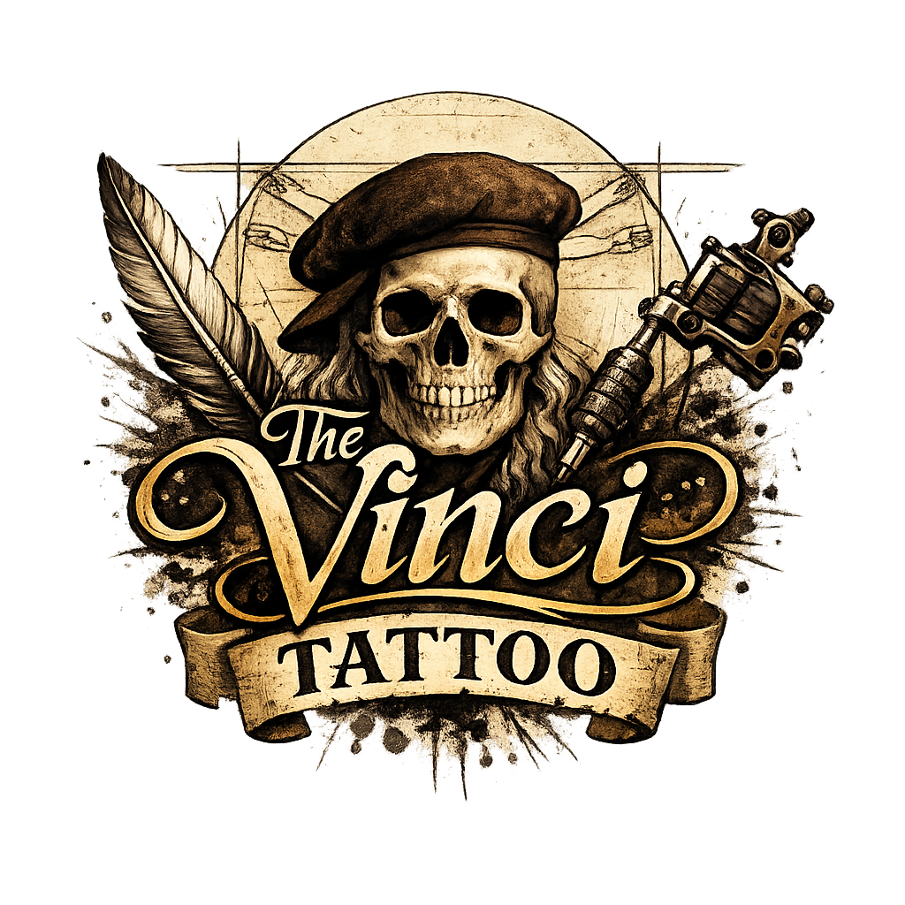

# The Vinci Tattoo Studio



A high-end, cinematic luxury tattoo studio website inspired by the genius of Leonardo da Vinci. This project blends classical art principles with modern web technology to create an ultra-premium digital experience.

## ✨ Features

- **Buttery Smooth Interactions**: Integrated with Lenis for fluid, momentum-based scrolling.
- **Cinematic Visuals**: GSAP-powered animations, parallax effects, and glassmorphism UI.
- **Dynamic Portfolio**: A responsive, pedestal-style masterpiece gallery featuring high-resolution tattoo artistry.
- **Interactive Video Showcase**: Custom-built video player for an immersive "Art in Motion" experience.
- **Seamless Lead Generation**: Direct WhatsApp integration for consultations and inquiries.
- **Awwwards-Level Design**: Meticulously crafted typography, gold-accented dark mode, and atmospheric particle systems.

## 🚀 Technologies Used

- **Frontend**: HTML5, CSS3 (Vanilla), JavaScript (ES6+)
- **Animation**: [GSAP](https://greensock.com/gsap/) (ScrollTrigger)
- **Scrolling**: [Lenis](https://github.com/darkroomengineering/lenis)
- **Slider**: [Swiper.js](https://swiperjs.com/)
- **Icons**: Font Awesome

## 🛠️ Installation & Setup

1. Clone the repository:
   ```bash
   git clone https://github.com/prosenjitdey2143/the-vinci-tattoo-studio.git
   ```
2. Open `index.html` in your browser or use a live server for the best experience.

## ✒️ Artistic Vision

Rooted in the timeless principles of Leonardo da Vinci, we merge art, anatomy, and emotion to craft tattoos that are as meaningful as they are masterful. Every line we draw is a tribute to precision.

## 📄 License

© 2024 The Vinci Tattoo Studio. All rights reserved.
